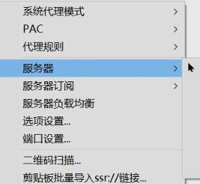

# Cross GFW

敏感词：翻墙 vpn ssr ShadowsocksR v2rayN

翻墙是违法行为?-->[True](https://www.bilibili.com/read/cv6861022)

## 不关机的电脑

每当我们浏览网页时，会看到一张张的图片，而这些图片，和我们自己电脑上的无二。

我们同时也会看到文字，这些，都是存储在所谓“服务器”里的。

比如我们在Quora上看回答，回答里面有图片，这些图片就是存储在Quora的服务器里。

而服务器，就像是不关机的电脑，随时等待着人们的请求，然后发送文字、图片或视频等信息，就像你和好友聊天时发送照片那样。

当然，像12306这种每天都要维护的网站，让服务器关机可能不会，但是在特定的时段访问，它会告诉你“关门”了。

## GFW

GFW的全称是Great Fire Wall。

**抽象**地说，我们向服务器发起请求时，会被GFW审查。

就好像写信，收件人的地址会被审查、信件的内容也会被审查。

如果收件人地址是Google的服务器，GFW可能就把地址给改了，Google永远也收不到，同时，发件人也永远收不到Google的回信。

## 代理

既然不让我们写给Google，那么我们就写给别人，这个人在GFW看起来是安全的，让别人来替我们与Google交流，同时，交流的内容还要加密，使得看起来没有问题，以避免对信件内容的审查。

方法有了，我们要分析具体的需求。以流行的翻墙软件为例，往往需要我们填写“**服务器地址**”和“**加密方式**”。

## 地址和加密

服务器地址就是你要找的代理人的地址，加密方式就是信件内容要怎样加密以骗过GFW的审查。

以**https://www.google.com**为例，https是一种加密方式，www.google.com是收信人地址。使用如果使用https，收信人的地址是公开的，所以，GFW一看要访问Google的服务器，就直接对信动手脚，这封信就永远送不到Google手了。

所以我们地址不能直接填www.google.com了，要填另一个服务器的地址，既然要和代理说话，那语言也不能是https了，要换，所以，我们会看到如下的情况：

形式上和https://xxx很像

或者我们会看到

都有**地址**和**加密方式**。

## 软件使用

用ShadowsocksR和v2rayN两款软件。

它们都是绿色软件，只要部件齐全，放哪都能用。它们也在GitHub上开源了，我已经star了这两个项目，找到release下载即可。

推荐使用v2rayN。

### ShadowsocksR

ShadowsocksR文件夹内部

#### 运行

双击运行，可在任务栏找到图标，不论是什么颜色，是一只小飞机：

#### 复制服务器地址

在GitHub上，寻找公共的服务器，大家一般把它叫做“节点”。

将其复制到剪贴板：

#### 导入到剪贴板

#### 选择服务器

选一个服务器，建议在导入前，清空全部的服务器，保证接下来选择的服务器是刚才导入的。

#### 系统代理模式

接下来选择系统代理模式

1. 直连模式就是流量不经过代理服务器，例如访问百度
2. PAC模式就是有的走代理，有的不走代理
3. 全局就是全部走代理

#### 科学上网

墙的存在，利大于弊，若你不同意我的说法，你是对的，~我是傻逼~。

### v2rayN

在GitHub上找到该项目后，下载**v2rayN-Core**，关于v2rayN和v2rayN-Core的区别可见[此issue](https://github.com/2dust/v2rayN/issues/106)。

v2rayN-Core文件夹内部：

使用方式和ShadowsocksR相同：

1. 找节点并复制地址
2. 从剪贴板导入url
3. 选择服务器
4. 选择代理模式
5. 科学上网

v2rayN直连时，任务栏的图标是蓝色的，配置时，是紫色的，全局是红色的。

## 可能的问题

### 保证软件运行

保证自己只有一个软件在运行，不可同时打开两个软件，Chrome或者Edge上的翻墙插件也必须关闭。

### 上不了GitHub

ssr（ShadowsocksR）对于GitHub默认是走配置，如果上不了GitHub，说明节点挂了，可以更换节点，或选择直连，然后继续在GitHub上寻找节点导入测试。

### 服务器变更

要重新导入节点

### 其他问题

请到[v2rayN的issue页面](https://github.com/2dust/v2rayN/issues)自行搜索解决方案。

